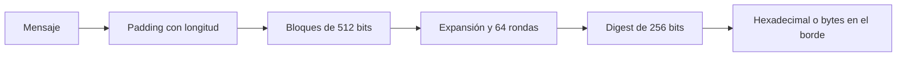

# Hashes y contraseñas

## Concepto y problema

Una función hash criptográfica transforma una entrada de longitud variable en
un digest de tamaño fijo. Su utilidad no es ocultar el mensaje: permite
detectar cambios, construir compromisos y alimentar otras construcciones. Para
que una construcción basada en hash sea útil, una entrada modificada debe
producir un digest impredeciblemente distinto y encontrar preimágenes o
colisiones debe ser computacionalmente inviable bajo los supuestos del
algoritmo.

SHA-256 procesa datos por bloques de 512 bits y produce 256 bits. El modelo del
crate implementará padding, expansión de palabras y rondas de compresión para
mostrar esa transformación. Los vectores conocidos verifican conformidad, pero
no prueban resistencia a canales laterales ni aptitud para producción.

## Codificación no es criptografía

Hexadecimal y Base64 convierten bytes en texto transportable; cualquier
participante puede invertirlos. Cifrado busca confidencialidad; hash busca una
huella; una firma busca autenticidad e integridad. Nombrar correctamente cada
operación evita protocolos que parecen seguros solo porque sus bytes son poco
legibles.

## Contrato e invariantes

El digest SHA-256 del crate debe ser determinista, de 32 bytes y coincidir con
vectores públicos para entradas vacías y textos conocidos. El estado de cada
bloque se procesa con aritmética modular de 32 bits. La API recibirá bytes y
devolverá bytes, dejando la presentación hexadecimal al borde del programa.

El modelo no genera aleatoriedad, no protege memoria contra observación y no
debe usarse como dependencia criptográfica de producción. La prueba de una
propiedad real requiere revisión especializada y una implementación auditada.

## Password hashing

SHA-256, incluso con sal, es rápido por diseño. Esa velocidad ayuda a procesar
datos, pero favorece intentos masivos de adivinar contraseñas. Para producción,
las contraseñas se procesan con una KDF adaptativa y resistente a memoria, como
Argon2id, usando una biblioteca mantenida; la sal es única y se almacena junto
al resultado.

Una sal no vuelve lento un hash ni sustituye una KDF. Evita que dos contraseñas
iguales compartan resultado y reduce reutilización de tablas precalculadas.
El curso no implementa una KDF casera porque una aproximación incompleta sería
más peligrosa que instructiva.

## Alternativas y límites

BLAKE3 puede ser una buena elección moderna para hashing general en contextos
apropiados; SHA-256 sigue siendo valioso para interoperabilidad y para enseñar
una función Merkle-Damgard. Las funciones de checksum no criptográficas sirven
para errores accidentales, no para adversarios. La decisión depende de la
propiedad y protocolo, nunca de un nombre de algoritmo aislado.

## Recorrido



El modelo expone el digest como bytes para mantener la frontera entre datos y
presentación. El hexadecimal es útil para pruebas, logs y protocolos de texto,
pero no transforma las propiedades del digest.

## Modelo educativo

```rust
use rust_crypto::sha256::sha256;

let digest = sha256(b"abc");
assert_eq!(digest.len(), 32);
assert_eq!(digest[0], 0xba);
```

La prueba de `abc` coincide con un vector público. Esa coincidencia valida el
algoritmo modelado; no valida una política de claves, una integración de red o
la resistencia operativa de esta implementación.

## Contraseñas en sistemas reales

Una aplicación no debe guardar `sha256(password)`. Tampoco basta con añadir
una sal a SHA-256. El diseño correcto usa Argon2id u otra KDF recomendada por
el entorno, con sal única y parámetros de costo que puedan actualizarse. La
biblioteca auditada conserva el formato de almacenamiento y la comparación
adecuada; el sistema registra la versión de parámetros para poder migrar.

## Ejercicios y soluciones orientativas

1. **Compara dos entradas.** Calcula el digest de `abc` y `abd`. Solución:
   deben diferir; esa observación ilustra difusión, pero no es una prueba
   estadística de seguridad.
2. **Clasifica una transformación.** Decide si Base64, SHA-256 y AES cifran.
   Solución: Base64 codifica, SHA-256 crea una huella y AES cifra con clave.
3. **Diseña el almacenamiento de una contraseña.** Solución: elige una KDF
   auditada, sal única, parámetros versionados y una ruta de migración; nunca
   diseñes un formato nuevo a partir de este crate.

## Lista de verificación

- [x] Los vectores públicos verifican entradas de uno y varios bloques.
- [x] La API maneja bytes; el formato de texto queda en el borde.
- [x] El capítulo explica que hashing general no es password hashing.
- [x] No se recomienda el modelo para producción.
