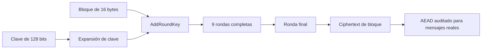

# Cifrado simétrico y contraseñas

## Concepto y problema

El cifrado simétrico protege confidencialidad mediante una clave compartida.
AES es un cifrado de bloque: transforma exactamente 16 bytes bajo una clave.
Esa definición no indica cómo cifrar mensajes largos, detectar cambios ni
generar nonces. Usar el bloque solo deja problemas de protocolo sin resolver.

El modelo educativo implementará AES-128 para observar su estado de 4 por 4,
expansión de clave y rondas. No ofrecerá un modo de operación ni una API para
cifrar archivos o mensajes; esa ausencia evita que un ejemplo de algoritmo se
confunda con un diseño de producto.

## Contrato e invariantes

AES-128 usa una clave de 16 bytes y cifra un bloque de 16 bytes. El modelo debe
coincidir con un vector NIST conocido. Cada ronda aplica sustitución, permuta,
mezcla de columnas y suma de clave; la ronda final omite la mezcla de columnas.

La coincidencia de un vector solo verifica la operación de bloque. No prueba
autenticación, manejo de errores, resistencia a tiempos ni administración de
secretos. El crate no expone descifrado, modos, almacenamiento de claves o
aleatoriedad porque esos elementos requieren un contrato más amplio.

## Modos, nonces y autenticación

Para producción se prefiere un modo AEAD, como AES-GCM o ChaCha20-Poly1305,
desde una biblioteca auditada. AEAD entrega confidencialidad e integridad bajo
sus reglas de nonce y datos asociados. Un nonce debe respetar la unicidad que
exige el modo: repetirlo bajo una misma clave puede destruir la seguridad.

ECB revela patrones y no es una elección para mensajes. CBC necesita
autenticación separada y manejo correcto de padding. Un cifrado que no detecta
modificaciones permite ataques aun cuando nadie pueda leer su contenido.

## Secretos y contraseñas

Una contraseña no es una clave AES. La derivación de claves en producción usa
una KDF auditada con sal, costo y parámetros versionados. Las claves se
guardan y rotan mediante mecanismos operativos apropiados; no en código,
logs, variables de ejemplo ni estructuras que pretendan borrar memoria sin una
garantía real.

## Alternativas y límites

AES tiene amplia interoperabilidad y aceleración de hardware en muchos
objetivos. ChaCha20-Poly1305 puede ser preferible donde esa aceleración no
existe. La alternativa correcta depende del protocolo, plataforma y biblioteca
mantenida. Esta unidad enseña las transformaciones internas de AES, no decide
un esquema de producción.

## Recorrido



El diagrama termina antes de una API de mensajes porque AES de bloque no define
autenticación, framing ni nonces. Esas decisiones pertenecen al modo AEAD y a
su biblioteca auditada.

## Modelo educativo

```rust
use rust_crypto::aes128::encrypt_block;

let key = [0_u8; 16];
let block = [0_u8; 16];
let ciphertext = encrypt_block(key, block);

assert_eq!(ciphertext.len(), 16);
```

El ejemplo demuestra la frontera del modelo: recibe y entrega exactamente un
bloque. No debe extenderse concatenando bloques ni reutilizarse para datos
reales.

## Ejercicios y soluciones orientativas

1. **Distingue propiedades.** ¿Qué falta después de cifrar con AES? Solución:
   autenticidad e integridad; una construcción AEAD resuelve ambas bajo su
   contrato de nonce y datos asociados.
2. **Audita un nonce.** Un servicio genera nonces con un contador reiniciado.
   Solución: el diseño es inseguro si repite nonce bajo la misma clave; usa la
   estrategia recomendada por la biblioteca y conserva su estado necesario.
3. **Convierte una contraseña en clave.** Solución: no apliques SHA-256 ni
   rellenes bytes; usa una KDF auditada con sal y parámetros de costo.

## Lista de verificación

- [x] AES-128 coincide con un vector NIST de un bloque.
- [x] El modelo no presenta un modo de operación como seguro por omisión.
- [x] AEAD, nonces y KDF se describen como decisiones obligatorias de producción.
- [x] No se usa `unsafe`, aleatoriedad casera ni dependencias externas.
