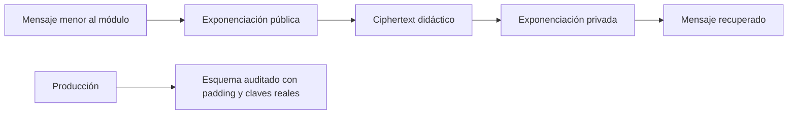

# Clave pública y firmas

## Concepto y problema

La criptografía de clave pública separa una clave pública de una privada para
permitir cifrado, intercambio de claves y firmas sin compartir un secreto de
antemano. RSA se apoya en aritmética modular y en la dificultad de factorizar
números grandes; la criptografía de curva elíptica se apoya en el problema del
logaritmo discreto sobre una curva. Sus ecuaciones no bastan: padding, tamaños,
aleatoriedad, validación y protocolos son parte de la seguridad.

El modelo del crate usará enteros pequeños para observar exponenciación modular
y el ciclo de RSA. Ese tamaño hace factorizable la clave y no habrá padding, por
lo que el modelo es explícitamente inseguro para cualquier dato real.

## Contrato e invariantes

La exponenciación modular debe evitar overflow intermedio mediante una
representación más amplia. Para un ejemplo RSA pequeño, el mensaje debe estar
en el rango de su módulo y la operación privada debe recuperar el valor
cifrado. Las pruebas demuestran aritmética, no confidencialidad práctica.

El módulo no genera claves, no acepta datos arbitrarios ni implementa OAEP,
PSS, ECDSA, EdDSA o validación de puntos. Una API que ocultara esas ausencias
sería más engañosa que un ejemplo limitado.

## RSA, ECC y firmas

RSA moderno requiere módulos grandes, padding probabilístico y una biblioteca
auditada. Cifrar con RSA directo o firmar un digest sin esquema de firma no es
un protocolo seguro. El modelo solo muestra por qué una clave pública y una
privada forman operaciones complementarias.

ECC obtiene seguridad con claves más compactas, pero exige curvas y
implementaciones cuidadosamente seleccionadas. En producción se prefiere una
API de alto nivel para X25519, Ed25519 o esquemas recomendados por el
protocolo. Validar puntos, nonces de firma y formatos es indispensable.

Una firma aporta autenticidad e integridad de un mensaje bajo una clave; no
aporta confidencialidad. El protocolo debe incluir contexto, algoritmo,
versión, codificación y protección contra replay cuando corresponda.

## Alternativas y límites

Para un sistema real, la alternativa no es reimplementar RSA o ECC: es elegir
una biblioteca mantenida y su API de protocolo. La implementación didáctica
permite seguir la matemática; la biblioteca auditada asume la responsabilidad
de tamaños, padding, validación y canales laterales.

## Recorrido



El recorrido superior explica la aritmética; la rama de producción enfatiza que
no es el mismo protocolo. RSA directo sin padding revela estructura y no debe
usar para cifrar o firmar mensajes reales.

## Modelo educativo

```rust
use rust_crypto::rsa_demo::RsaExample;

let rsa = RsaExample::textbook();
let ciphertext = rsa.encrypt(65);
assert_eq!(rsa.decrypt(ciphertext), 65);
```

Los números del ejemplo son conocidos y factorizables. La lección no consiste
en guardar esos valores, sino en observar cómo dos exponentes relacionados
restauran el mensaje bajo un módulo pequeño.

## Ejercicios y soluciones orientativas

1. **Explica el límite del mensaje.** ¿Por qué el ejemplo requiere un entero
   menor que el módulo? Solución: la aritmética opera en ese anillo; mensajes
   grandes requieren codificación y, en producción, un esquema seguro.
2. **Compara cifrado y firma.** Solución: la firma demuestra posesión de una
   clave privada y no oculta el mensaje; el cifrado busca confidencialidad.
3. **Elige una integración.** Solución: para una firma moderna usa una API
   auditada que fije algoritmo, formato y validación; no combines `mod_pow`
   con bytes de aplicación.

## Lista de verificación

- [x] El ejemplo RSA prueba aritmética modular, no seguridad operativa.
- [x] El capítulo trata padding, tamaños y validación como condiciones esenciales.
- [x] ECC y firmas se explican con sus límites de protocolo.
- [x] No se presentan claves pequeñas como material criptográfico reutilizable.
