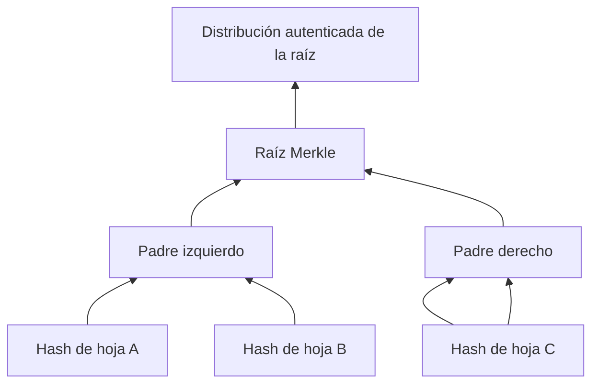

# Integridad y protocolos

## Concepto y problema

Un árbol de Merkle resume muchas hojas en una raíz: cada nodo interno hashea
los dos hijos y un cambio en cualquier hoja cambia la raíz. Esta estructura
permite verificar pertenencia con una prueba corta, pero no autentica por sí
sola quién publicó la raíz. Un MAC añade autenticidad simétrica; una firma
permite verificarla con clave pública.

TLS, JWT y OAuth son protocolos o formatos que componen estas primitivas con
identidades, contextos, expiración, negociación y validación. No se vuelven
seguros al llamar a SHA-256 desde una aplicación.

## Contrato e invariantes

El modelo Merkle del crate debe usar SHA-256, conservar el orden de hojas y
duplicar la última hoja en niveles impares. La raíz de una hoja será su hash;
la de cero hojas se rechaza porque no existe un compromiso de contenido sin un
contrato adicional. Cambiar una hoja debe cambiar la raíz en las pruebas.

El modelo no ofrece pruebas de inclusión, MAC, firmas ni persistencia de una
raíz confiable. Estas decisiones requieren un formato y una fuente de
autenticidad definidos por el protocolo.

## TLS, JWT y OAuth

TLS protege un canal mediante negociación, certificados y claves efímeras. Se
usa mediante una biblioteca y configuración actualizadas, nunca reimplementando
handshake ni validación de certificados.

JWT es un formato de token, no una política de autorización. Su integración
valida algoritmo permitido, firma, emisor, audiencia, expiración y contexto; no
acepta el algoritmo declarado por datos no confiables. OAuth delega
autorización y exige flujos, redirecciones, PKCE, scopes y validación de
tokens; no equivale a "usar JWT".

## Alternativas y límites

Un hash simple detecta cambios solo si la referencia esperada ya es confiable.
Un MAC requiere secreto compartido; una firma cambia quién puede verificar.
La construcción correcta se escoge según amenaza y distribución de claves, no
por conveniencia de la API.

## Recorrido



Duplicar la última hoja cuando un nivel es impar hace el árbol determinista
para el modelo. Otras especificaciones pueden usar reglas distintas; dos
participantes deben acordarlas antes de comparar raíces.

## Modelo educativo

```rust
use rust_crypto::merkle::merkle_root;

let root = merkle_root(&[b"a" as &[u8], b"b" as &[u8]]);
assert!(root.is_some());
```

La raíz compromete contenido y orden. No prueba identidad de quien la publicó:
un atacante que pueda sustituir raíz y hojas puede presentar un árbol coherente.
Una firma o un canal autenticado aporta esa propiedad adicional.

## Integración responsable de protocolos

Para TLS, delega handshake, certificados y suites criptográficas a la pila
madura del entorno y conserva validación de hostname y cadena. Para JWT,
declara algoritmos permitidos fuera del token, valida todos los claims
relevantes y limita duración y audiencia. Para OAuth, usa Authorization Code
con PKCE cuando corresponda, registra redirecciones exactas y trata el token
como credencial, no como identidad autosuficiente.

## Ejercicios y soluciones orientativas

1. **Mueve una hoja.** ¿Cambia la raíz si intercambias dos hojas? Solución: sí,
   porque el orden forma parte del input de cada padre.
2. **Elige autenticidad.** Debes compartir la raíz con varios verificadores.
   Solución: usa una firma sobre el contexto y la raíz; un MAC requeriría que
   todos compartieran el secreto.
3. **Audita un JWT.** Solución: verifica firma, algoritmo permitido, emisor,
   audiencia, expiración y contexto; no aceptes el token solo por decodificar.

## Lista de verificación

- [x] El árbol conserva orden y define su regla para niveles impares.
- [x] La raíz no se confunde con autenticidad.
- [x] TLS, JWT y OAuth se presentan como protocolos a integrar, no reescribir.
- [x] Los ejemplos no emiten ni validan credenciales reales.
